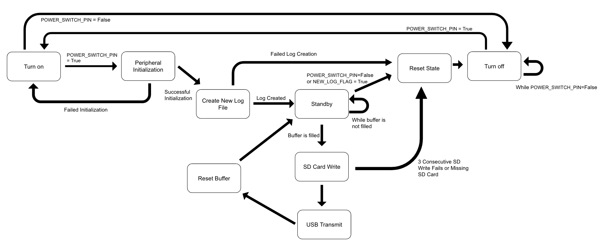
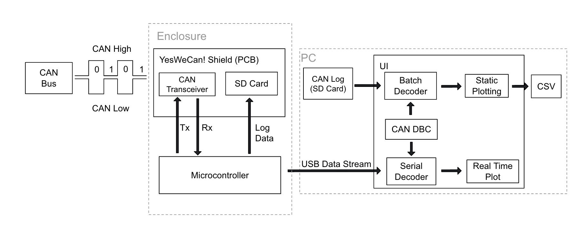
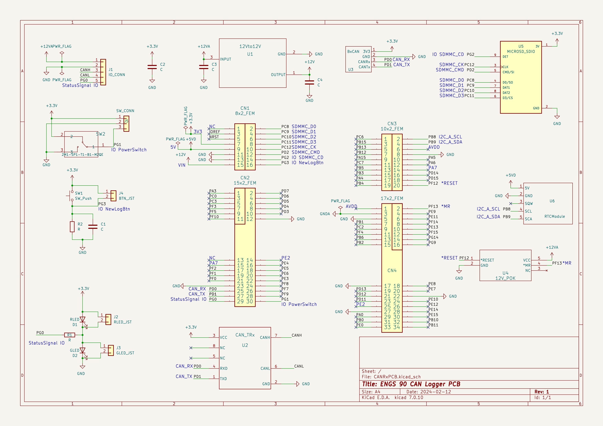

# YesWeCan! - CAN Data Logger
## Team 20 - ENGS 89/90 - 2023-2024
Dartmouth Formula Racing CAN Data Logger for STM32 Nucleo F767ZI code using HAL and FatFs on the STM32CubeIDE. When plugged into a CAN network it will log data to a micro SD card and send real-time data via micro-USB. It is meant to be used in tandem with https://github.com/Dartmouth-Formula-Racing/engs90-gui for decoding messages with a dbc file.

<p align="center">

</p>


| Specifications |  |
| --- | --- |
|  Guaranteed CAN Message Rate | 3000 messages/sec |
| Total Record Time | 92 hours @3k messages/sec (32GB SD Card) |
| USB Transfer Speed |USB 1.1 (12 Mbps) |
| File Names | ISO 8601 in UTC, Local time provided after decoding |
| Power Consumption | 1.68W (12V @140mA) |
|Maximum Input Voltage | 35V |
| Power Supervisor | Logger goes dormant at 8.5V & wakes up at 10V |
| Real Time Clock Battery Life | Minimum: 9 years, Typical: 14 years |


## Hardware
The logger is designed to be used in tandem with a PCB shield, a schematic can be found in the appendix. 

**PCB Design:** https://github.com/nestoreo/CANRxPCB

**Bill of Materials:** https://docs.google.com/spreadsheets/d/1NrKLE5knV5BPY-2oF7sqC7h2m7aHoQsADQELiZiT3k4/edit?usp=sharing

## Raw CAN Data Format
**Filename is in IO 8601:** YYYY-MM-DDTHH-MM-SSZ.log

**Example:** 2024-03-11T01:49:48Z.log 

**Raw CAN Data Format:** epochTimestamp#CANExtendedIdentifier#8bitDataPacket

**Example:**
```
0000001142#000A0003#FEC8FF6910130000
0000001142#000A0004#0013001800004B12
0000001143#000A0005#BDF1531500000000
0000001150#000A0003#FEC4FF6E10060000
0000001151#000A0004#00140019FFFF4B12
0000001151#000A0005#BDF1531500000000
```

The messages are sent in buffers of 18944 bytes or 512 messages per buffer. Tested up to CAN network speeds of 3000 messages per second without any message loss on a 32 GB micro SD card. The real-time data stream can be used to display data in real-time.

## Decoding CAN Data

The following code be used to decode the logs using a .dbc file created by the user or directly from the OEM. 

**Decoding and Plotting UI:** https://github.com/Dartmouth-Formula-Racing/engs90-gui

Has a graphical user interface to decode the messages and imports them into a pickled Python object stored on the user's computer which can then be plotted/pretty-printed on the UI. Also has an export to CSV function for further analysis. Additionally, there is a real-time plotting tool that can be used when the device is connected to a laptop to plot time series data as it is received (lowering the buffer size in the code can improve the smoothness of this function).

**Decoder Code:** https://github.com/Dartmouth-Formula-Racing/engs90-gui/blob/main/CANverter.py

The CANverter code can also be directly accessed to avoid the UI. Examples of turning logs to a pandas dataframe or CSV can be found at the bottom. There is also code for decoding a stream of messages one at a time for real-time plotting purposes.

**Note:** Logs of multiple GBs take a couple of minutes to decode

## Appendix


### State Diagram
<p align="center">
 
</p>

### Data Flow
<p align="center">
 
</p>

### Panel Mount I/O
<p align="center">
 
</p>
### Schematic
<p align="center">
 
</p>
